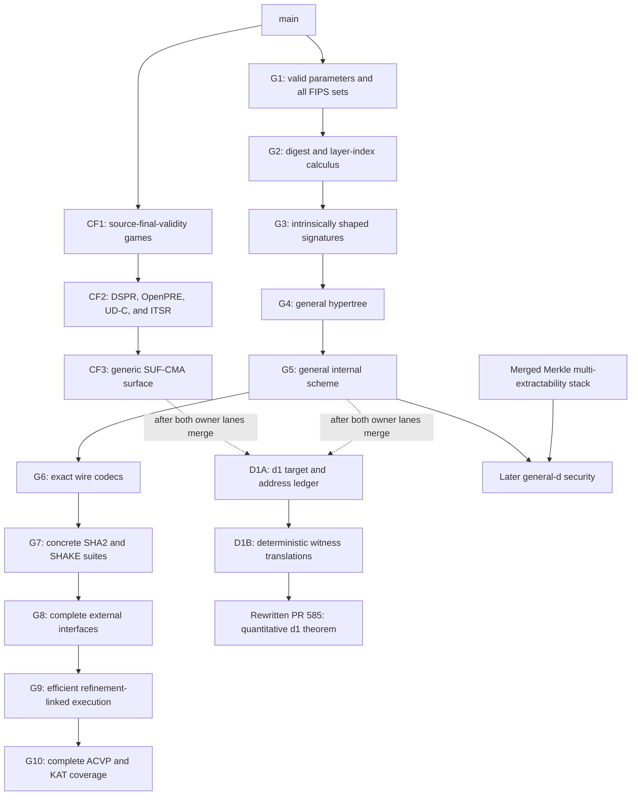

# SLH-DSA FIPS 205 generalization and conformance plan

Status: implementation plan, established 2026-08-30. This document fixes the target architecture,
pull-request ownership, dependency order, acceptance gates, and restacking protocol for moving the
current reduced-profile `d = 1` SLH-DSA development to a general, executable formalization of
FIPS 205. It is a plan, not an implementation-status report. A capability is present only when the
corresponding source and validation have merged.

The key outcome is one canonical SLH-DSA scheme that:

- is generic over every mathematically valid hypertree depth `d`;
- separately enumerates and fully instantiates all twelve FIPS 205 parameter sets;
- has exact, rejecting wire codecs and the complete internal, pure, and pre-hash interfaces;
- has a pure Lean executable path linked to the proof-level specification;
- passes pinned NIST Automated Cryptographic Validation Protocol (ACVP) vectors; and
- supports the existing `d = 1` security work as a specialization rather than as a second scheme.

This document uses **MUST**, **MUST NOT**, **SHOULD**, **SHOULD NOT**, and **MAY** as described by
[BCP 14](https://www.rfc-editor.org/info/bcp14) when, and only when, they appear in uppercase.

## Decision summary

The work uses three cooperating but independently mergeable lanes:

1. a generic cryptographic-foundations lane;
2. a general SLH-DSA scheme and FIPS-conformance lane; and
3. an SLH-DSA security lane.

The general scheme and conformance work MUST NOT be stacked on the current `d = 1` security PR.
That dependency would make basic FIPS algorithms, codecs, and known-answer tests depend on
unfinished security reductions. Instead, the security work will later rebase onto the general
scheme and use an explicit `d = 1` specialization theorem.

The Merkle multi-extractability stack remains parallel. The generic scheme may use the existing
Merkle execution API, but its definition, correctness, codecs, and KATs MUST NOT depend on a
Merkle security theorem. A later general-`d` security integration may consume the merged
multi-extractability result.



## Planning baseline

This plan was written against VCVio `main` at
`7e5986813a4c622bf686fa4c578a53dd14759808`.

At that baseline:

- [PR #573](https://github.com/Verified-zkEVM/VCVio/pull/573) is merged. It owns the consolidated
  reject-on-arrival SM-DT-TCR and SM-DT-PRE collection games.
- [PR #580](https://github.com/Verified-zkEVM/VCVio/pull/580) is closed as superseded by #573.
- [PR #585](https://github.com/Verified-zkEVM/VCVio/pull/585) is an open draft at
  `840b76238db064a5cd8f7bd2520c5fe321f86f68`. It mixes generic foundations, `d = 1` scheme
  adjustments, target enumeration, witness translations, and conditional quantitative security.
- the Merkle stack runs from [#574](https://github.com/Verified-zkEVM/VCVio/pull/574) through
  [#591](https://github.com/Verified-zkEVM/VCVio/pull/591). It is a parallel security foundation,
  not a prerequisite for FIPS conformance.

The current merged scheme has several deliberate reduced-profile boundaries:

- `Params` contains `h`, `d`, and `hp`, but it does not enforce `h = d * hp` or positivity;
- the named `ParameterSet` recognizes only the SP 800-230 initial-draft
  `SLH-DSA-SHA2-128-24` profile;
- `splitDigest` returns the FORS digest and leaf index but omits the tree index;
- the FORS base address and hypertree address use tree `0` and layer `0`;
- `HtSigCore` is one XMSS signature rather than `d` XMSS signatures;
- the concrete decoder is fixed to one 3,856-byte signature shape; and
- the external signature wrapper supports only pure signing with an empty context.

These observations describe the starting point. They are not defects in the reviewed scope of the
merged reduced-profile work.

## Scope

### In scope

This program includes:

- the arithmetic parameter model needed by Algorithms 1 through 20 of FIPS 205;
- exact structured representations of keys and signatures;
- Algorithms 12 and 13 for arbitrary positive `d`;
- Algorithms 18 through 20 for arbitrary valid SLH-DSA parameters;
- strict key and signature byte encodings;
- all twelve approved FIPS 205 parameter sets and their SHA2 or SHAKE primitive instantiations;
- Algorithms 21 through 25, including contexts, deterministic and hedged signing, and pre-hash
  signing and verification;
- efficient pure Lean execution for key generation, signing, and verification;
- refinement links between any optimized execution layer and the canonical specification;
- NIST ACVP key-generation, signature-generation, and signature-verification vectors; and
- preservation and later extension of the security formalization.

### Out of scope

The following are not part of the initial conformance milestone:

- a completed general-`d` EUF-CMA reduction;
- completion of the explicit program-transformation obligations already recorded by #585;
- treating the SP 800-230 limited-signature profiles as FIPS 205 approved parameter sets;
- treating C13 as a FIPS 205 parameter set; or
- using an FFI implementation as the trusted or canonical SLH-DSA implementation.

General-`d` security is a planned downstream consumer of the general scheme, not a condition for
merging the scheme and KAT stack.

## Architectural invariants

Every implementation PR MUST preserve the following invariants.

### One semantic scheme

There MUST be one canonical structured implementation of the SLH-DSA algorithms. Pure execution,
oracle-parametric execution, concrete hashing, byte interfaces, and optimized TreeHash code MUST
be interpretations or proved refinements of that implementation. The repository MUST NOT retain
indefinitely separate `d = 1` and general-`d` signing algorithms.

### Raw data, validity, and approval are separate

The arithmetic record `Params` is raw data. Mathematical validity is a predicate or proof bundle.
FIPS approval is a closed named enumeration. These concepts MUST NOT be collapsed:

- generic algorithms should work for any validated parameters;
- the twelve FIPS parameter sets should be concrete consumers of that generic interface; and
- research or limited-use profiles should be named separately.

### Structured values are intrinsically shaped

Internal signatures MUST carry the lengths required by their parameter set. Malformed byte
strings belong at the decoding boundary. Proof-level verification MUST NOT repeatedly compensate
for authentication paths represented by unconstrained lists.

### Parsing is strict

Attacker-controlled byte input MUST use checked parsing. Decoders MUST reject short, long, or
otherwise malformed inputs. They MUST NOT silently zero-pad, ignore trailing input, or depend on
unchecked indexing.

### Proof libraries remain link-safe

`HashSig` MUST NOT import `Extern`. Native implementations MAY be used from a test library as
differential oracles, but not as the implementation whose correctness or KAT success is claimed.
No new `unsafe`, custom axiom, `sorryAx`, or `native_decide` trust is permitted by this program.

### Security statements name their exact scope

The current quantitative security work is a `d = 1` specialization. Its names and theorem
statements MUST retain that scope until the multi-layer reductions are proved. Passing FIPS KATs
MUST NOT be presented as a security proof, and a deterministic witness translation MUST NOT be
presented as a probability bound without its game and resource bridges.

## Parameter architecture

### Raw parameters

The current primary fields remain useful:

```lean
structure Params where
  n   : Nat
  h   : Nat
  d   : Nat
  hp  : Nat
  a   : Nat
  k   : Nat
  lgw : Nat
```

Derived values such as `w`, `len1`, `len2`, `len`, `m`, and wire sizes remain functions of this raw
record.

### Mathematical validity

The general algorithms MUST consume an explicit validity proof or a bundle such as:

```lean
structure Params.Valid (p : Params) : Prop where
  n_pos       : 0 < p.n
  d_pos       : 0 < p.d
  hp_pos      : 0 < p.hp
  lgw_pos     : 0 < p.lgw
  h_eq_layers : p.h = p.d * p.hp

structure ValidatedParams where
  params : Params
  valid  : params.Valid
```

The final predicate may contain additional arithmetic facts when they are genuinely required by
all algorithmic consumers. Encoding-specific bounds, especially bounds needed only by compressed
SHA2 addresses, SHOULD live in the concrete instantiation or reachable-address layer rather than
in the generic parameter predicate.

An explicit bundle is preferred to pervasive value-dependent typeclass search. Proof fields may
be erased by proof irrelevance; primary numeric fields remain directly executable.

### Approved FIPS parameter sets

FIPS 205 approves six numerical shapes, each with SHA2 and SHAKE instantiations.

| Shape | `n` | `h` | `d` | `hp` | `a` | `k` | `lgw` | `m` | Signature bytes |
| --- | ---: | ---: | ---: | ---: | ---: | ---: | ---: | ---: | ---: |
| 128s | 16 | 63 | 7 | 9 | 12 | 14 | 4 | 30 | 7,856 |
| 128f | 16 | 66 | 22 | 3 | 6 | 33 | 4 | 34 | 17,088 |
| 192s | 24 | 63 | 7 | 9 | 14 | 17 | 4 | 39 | 16,224 |
| 192f | 24 | 66 | 22 | 3 | 8 | 33 | 4 | 42 | 35,664 |
| 256s | 32 | 64 | 8 | 8 | 14 | 22 | 4 | 47 | 29,792 |
| 256f | 32 | 68 | 17 | 4 | 9 | 35 | 4 | 49 | 49,856 |

`FipsParameterSet` MUST enumerate the twelve names obtained by pairing these shapes with SHA2 and
SHAKE. Each constructor MUST expose:

- the exact `Params` value;
- the hash family;
- a proof of parameter validity;
- the expected key, digest, and signature sizes; and
- executable or theorem-level checks against the table.

The SP 800-230 reduced profiles MUST use a separate type or namespace such as
`LimitedParameterSet`. C13 MUST remain a separate scheme variant because WOTS+C, FORS+C, and its
Keccak rules are not the FIPS 205 construction. C13 MAY reuse the generic index and hypertree
infrastructure when its component interfaces align.

## Digest and hypertree positions

### Exact digest decomposition

The message digest decomposition MUST expose every FIPS output:

```lean
structure DigestParts (p : Params) where
  md      : Bytes p.digestBytes
  idxTree : Fin (2 ^ (p.h - p.hp))
  idxLeaf : Fin (2 ^ p.hp)
```

The corresponding theorem family MUST establish:

- the exact byte slices used for all three fields;
- the big-endian interpretation;
- the prescribed modular reductions;
- the bounds represented by the two `Fin` values; and
- for `d = 1`, that `idxTree` is the unique element of `Fin 1`.

The `d = 1` result is a specialization theorem, not a branch in the generic parser.

### Layer-indexed positions

The general hypertree needs a representation that records which tree and leaf are reachable at a
particular layer. The intended interface is equivalent to:

```lean
structure LayerPosition (p : ValidatedParams) (layer : Fin p.params.d) where
  tree : Fin (2 ^ (p.params.h - (layer.val + 1) * p.params.hp))
  leaf : Fin (2 ^ p.params.hp)
```

The exact exponent may be expressed through an equivalent arithmetic normalization if that makes
Lean proofs more stable. The public API MUST still establish the FIPS recurrence:

- layer zero receives the digest's `idxTree` and `idxLeaf`;
- the next leaf is the low `hp` bits of the current tree index;
- the next tree is the remaining high bits; and
- the tree index at the final layer is zero.

This position API is the canonical owner of layer/tree/leaf reachability. Address-injectivity and
security-target proofs SHOULD consume it instead of rederiving their own bounds.

## Structured keys and signatures

The internal representation SHOULD use named structures rather than nested products. Its shapes
MUST be intrinsic:

```lean
structure XmssSigCore (p : Params) (core : CorePrimitives p) where
  wots : Vector core.Y p.len
  auth : Vector core.Y p.hp

structure ForsTreeSigCore (p : Params) (core : CorePrimitives p) where
  sk   : core.Y
  auth : Vector core.Y p.a

abbrev ForsSigCore (p : Params) (core : CorePrimitives p) :=
  Vector (ForsTreeSigCore p core) p.k

abbrev HtSigCore (p : Params) (core : CorePrimitives p) :=
  Vector (XmssSigCore p core) p.d

structure SignatureCore (p : Params) (core : CorePrimitives p) where
  randomness : core.Y
  fors       : ForsSigCore p core
  hypertree  : HtSigCore p core
```

Exact names may change to fit local naming conventions. The represented data and invariants may
not drift without revising this design document.

The migration MUST update FORS, XMSS, query bounds, correctness proofs, and tests in one coherent
slice. It MUST NOT leave two long-lived signature representations connected only by partial
conversion functions.

## General hypertree and scheme

### Algorithms 12 and 13

The hypertree signer MUST produce exactly `d` XMSS signatures in increasing layer order. At each
layer it MUST:

1. set the layer and tree address from the current `LayerPosition`;
2. XMSS-sign the current message at the current leaf;
3. recover or compute the signed XMSS root;
4. use that root as the next layer's message; and
5. advance the tree and leaf indices by the FIPS recurrence.

Verification MUST perform the same fold over the supplied vector and compare only the final
recovered root with `PK.root`.

The hypertree slice MUST provide:

- callback-parametric and explicit-public-hash programs where both APIs remain useful;
- deterministic interpretations through the existing `PublicHash` implementation;
- naturality under query-preserving monad morphisms;
- structural query bounds parameterized by `d`; and
- correctness for every valid parameter set and total deterministic public-hash implementation.

### Algorithms 18 through 20

The general internal scheme MUST:

- compute the public root from the final hypertree layer;
- retain `md`, `idxTree`, and `idxLeaf` from `H_msg`;
- build the FORS address with the actual lowest-layer tree and leaf;
- sign and recover the FORS public key at that address;
- invoke the general hypertree with the digest-derived position; and
- verify through the same position and address schedule.

The scheme slice MUST prove perfect deterministic correctness and preserve the explicit public-hash
oracle schedule. It MUST also expose closed-form `d = 1` theorems showing that:

- the tree index is zero;
- the hypertree vector has one element; and
- the general sign and verify programs reduce to the established one-layer schedule.

These theorems are the compatibility boundary for the rewritten security PR.

## Primitive and instantiation architecture

The existing abstract `CorePrimitives` and `Primitives` split remains the proof-facing interface.
FIPS conformance requires a byte-exact instantiation layer in which seeds and nodes are
`Bytes p.n` and addresses have the family-specific serialization.

### SHAKE parameter sets

All six SHAKE parameter sets use SHAKE256 and the full 32-byte `ADRS`. The implementation SHOULD
extend the existing pure Keccak-f[1600] sponge rather than introduce a second permutation. It MUST
support variable output lengths and the exact FIPS domain padding.

### SHA2 parameter sets

Every SHA2 parameter set uses the compressed 22-byte `ADRSc`; none of the SHA2 instantiations
serialize the full 32-byte `ADRS`. The hash choices divide as follows:

- for `n = 16`, the SHA2 functions use SHA-256, HMAC-SHA-256, and MGF1-SHA-256;
- for `n = 24` or `n = 32`, `H_msg` and `PRF_msg` use the SHA-512-based MGF1 and HMAC
  constructions, and `H` and `T_l` use SHA-512, while `F` and `PRF` continue to use SHA-256.

The existing SHA-256 code SHOULD be generalized where that reduces duplication without weakening
the exact formulas. SHA-512 and its derived variants MUST have independent primitive KATs before
they are used as evidence for SLH-DSA KATs.

### Address encoding

`Adrs` may remain a structural record with natural-number fields. Concrete encoders MUST establish
the reachable-field bounds needed to prevent truncation ambiguity. In particular, every SHA2
security proof MUST use restricted injectivity on reachable compressed addresses, not a false
global injectivity claim about `ADRSc`.

## Wire codecs

The wire layer MUST cover secret keys, public keys, and signatures. Its primary decoder should
return `Except DecodeError ...` or an equivalently informative checked result. A Boolean external
verifier MAY map every decoding failure to `false`.

For each encoded object, the codec slice MUST prove:

- the exact output length;
- `decode (encode x) = ok x`;
- canonical decoding or encoder injectivity;
- complete consumption of the input; and
- absence of unchecked indexing on malformed input.

The signature codec MUST derive offsets from the parameter record rather than from constants for
one profile. Tests MUST cover every boundary between `R`, each FORS element and path, every WOTS
signature, and every XMSS authentication path.

## Complete external interfaces

The external layer MUST formalize the FIPS distinction between internal messages and externally
encoded messages.

### Pure interface

For context `ctx` and message `M`, the pure interface uses:

```text
M' = 0x00 || toByte(|ctx|, 1) || ctx || M
```

Signing MUST reject a context longer than 255 bytes. Verification MUST return `false` for that
input. Context lengths `0`, `255`, and `256` are required boundary tests.

### Pre-hash interface

The pre-hash interface uses:

```text
M' = 0x01 || toByte(|ctx|, 1) || ctx || OID || PH(M)
```

The proof-facing design SHOULD separate a generic pre-hash descriptor—OID, executable digest, and
output convention—from the currently approved named algorithms. The concrete ACVP interface MUST
support the algorithms tested by the pinned NIST corpus:

- SHA2-224, SHA2-256, SHA2-384, and SHA2-512;
- SHA2-512/224 and SHA2-512/256;
- SHA3-224, SHA3-256, SHA3-384, and SHA3-512; and
- SHAKE-128 and SHAKE-256.

The mapping from each named algorithm to its OID and output length MUST be tested independently of
SLH-DSA signing.

### Deterministic and hedged signing

The internal signer continues to accept explicit `addrnd`. The external deterministic interface
uses the FIPS-prescribed deterministic value; the hedged interface accepts or samples `n` fresh
bytes. ACVP execution MUST use the supplied additional randomness exactly when the test group
requests nondeterministic signing.

## Efficient execution and refinement

The proof-level Merkle recursion is the specification. Full key-generation and signing KATs may
require a stack-based TreeHash and iterative authentication-path implementation.

The executable slice MUST follow these rules:

- use pure Lean data and computation;
- preserve address order and hash-call order where those are observable contracts;
- use arrays or vectors with checked bounds;
- expose deterministic functions suitable for KAT execution; and
- prove layer-level observational equality with the specification before the optimized path is
  described as verified.

The work SHOULD benchmark one key-generation, signing, and verification vector for each of the six
numerical parameter shapes before fixing CI timeouts. If the specification is already fast enough,
the executable slice may be a proof and performance record showing that no second implementation
is necessary. If optimized TreeHash is introduced, the following refinement chain is required:

```text
optimized leaf and node operations
  -> optimized subtree root and authentication path
  -> XMSS and FORS equality
  -> hypertree and SLH-DSA equality
  -> byte-level key and signature equality
```

Differential comparison with an FFI or external reference implementation is useful test evidence,
but it does not replace this refinement chain.

## ACVP and known-answer tests

The conformance source is the NIST ACVP SLH-DSA sample corpus. The import PR MUST record the exact
`usnistgov/ACVP-Server` commit and preserve the registration, prompt, and expected-result
provenance needed to regenerate the fixtures.

At planning time, these counts were measured against `usnistgov/ACVP-Server`
[`975de31eb83d87039ec88934fdc47d8c312b892d`](https://github.com/usnistgov/ACVP-Server/commit/975de31eb83d87039ec88934fdc47d8c312b892d):

- 120 key-generation cases;
- 624 signature-generation cases;
- 504 signature-verification cases; and
- 1,248 cases in total.

The corpus spans all twelve parameter sets, internal and external interfaces, deterministic and
nondeterministic signing, pure and pre-hash modes, and valid and deliberately modified
verification inputs.

Two executable targets are required:

- a PR smoke target with decisive coverage of every parameter set, hash family, interface class,
  and malformed-input boundary; and
- a full target that consumes the complete pinned corpus.

The full target MAY begin as a nightly or explicitly invoked CI job if its measured runtime is not
appropriate for every PR. The implementation milestone is not complete until the full target
passes in a documented supported environment.

KAT success MUST compare exact generated bytes for key generation and signing. A round-trip in
which the repository's signer is accepted only by its own verifier is necessary but insufficient.

## Cryptographic-foundations lane

The generic files currently introduced by #585 belong below the scheme-specific security proof.
They should be extracted into the following review slices after #573.

### CF1 — source-final-validity games

CF1 owns the generic final-validity monitor and source-final-validity TCR and PRE experiments.
It MUST preserve the reject-on-arrival experiments merged through #573 as distinct games. Public
names and docstrings MUST make the semantic choice explicit; CF1 MUST NOT silently change the
winning condition of an existing name.

### CF2 — remaining assumptions and reductions

CF2 owns generic DSPR, OpenPRE, UD-C, ITSR, the executable OpenPRE-to-DSPR/TCR reductions, and the
finite-fiber counting boundary. It MUST clearly distinguish proved reductions from the remaining
program-level probability coupling.

This slice MAY be divided into two PRs if OpenPRE and ITSR do not share a useful review boundary.

### CF3 — generic strong-unforgeability surface

CF3 owns additions to `SignatureAlg`: the SUF-CMA experiment, the EUF versus same-message
partition, and generic quantitative packaging. It MUST contain no SLH-DSA-specific target
enumeration or hash assumptions.

## Existing `d = 1` security work

PR #585 remains valuable and retains its number and top-level purpose. It will be rebuilt after
the general scheme and generic foundations provide stable owner APIs.

### D1A — target and address ledger

D1A owns:

- the explicit `Params.IsD1` specialization;
- the reduced SHA2-128-24 target profile;
- exact reachable target families and caps;
- `Nodup` proofs;
- full-width WOTS encoding injectivity; and
- restricted SHA2 `ADRSc` injectivity on every reachable family.

D1A MUST consume the generic layer-position and address APIs. It MUST NOT restore its own copy of
the one-layer scheme.

### D1B — deterministic witness translations

D1B owns the FORS, WOTS, and XMSS witness translations and their exact event decompositions. It
MUST state which facts are deterministic inclusions and which still require probability or
transcript transport.

### Rewritten PR #585

The rewritten unique slice of #585 owns:

- the composition certificate;
- the exact conditional low-level EUF-CMA expression;
- the concrete SHA2-128-24 corollary;
- the SUF-CMA residual and its fresh/reused `(R, M)` partition; and
- the explicit remaining program transformations and OpenPRE probability coupling.

#585 MUST remain draft until its advertised merge gate is satisfied. Its conditional theorem may
remain useful while the certificates are hypotheses, but its title and body must continue to say
so explicitly.

## Merkle integration and later general-`d` security

The Merkle stack through #591 proves addressed, stateful, multi-configuration extraction in one
shared homogeneous random oracle. It may become a principal input to general-`d` SLH-DSA security.

After G5 and the Merkle stack merge, a focused integration PR SHOULD connect:

- SLH-DSA layer and tree positions;
- the `publicHashSpec` query representation;
- configuration-tagged Merkle commitments and openings;
- honest-verifier query accounting; and
- layer-indexed reachable targets.

The intended later reduction path is:

```text
general-d SLH-DSA forgery
  -> layer/configuration-tagged Merkle disagreement
  -> shared-ROM multi-extractability event
  -> probability and resource bound
```

That work MUST be named as a later security milestone. The generic scheme and FIPS KAT stack MUST
not claim that it has already landed.

## Pull-request stack and ownership

Each row is an intended unique review slice. A row may split when implementation evidence shows
that its owner surface is too large, but adjacent rows MUST NOT be collapsed into a single giant
PR merely to reduce the number of branches.

| Slice | Primary owner surface | Required acceptance evidence |
| --- | --- | --- |
| CF1 | final-validity monitor and TCR/PRE variants | branch-order and final-validity canaries; full foundation build |
| CF2 | DSPR, OpenPRE, UD-C, ITSR and generic reductions | exact-game canaries; proved versus assumed boundary |
| CF3 | generic `SignatureAlg` SUF surface | EUF/new-message and same-message branch canaries |
| G1 | `Params`, validity, named FIPS sets | all table values and derived sizes checked |
| G2 | digest split, layer positions, address reachability | real multi-layer transition and boundary examples |
| G3 | FORS/XMSS/hypertree signature shapes | intrinsic lengths and migrated consumers |
| G4 | general hypertree programs and proofs | `d = 1`, `d = 2`, and FIPS multi-layer canaries |
| G5 | general internal scheme and correctness | generic completeness and one-layer specialization |
| G6 | key and signature wire codecs | round trips, exact sizes, short/long rejection |
| G7 | SHA2/SHAKE/pre-hash primitives and twelve instantiations | primitive KATs and exact formulas |
| G8 | Algorithms 21 through 25 | context and deterministic/hedged boundary tests |
| G9 | efficient execution and refinement | benchmarks and complete refinement chain |
| G10 | ACVP harness and pinned fixtures | smoke and full corpus results |
| D1A | d1 target/address ledger | exact caps, distinctness, restricted injectivity |
| D1B | deterministic witness translations | event-inclusion and malformed-input canaries |
| #585 | conditional quantitative d1 theorem | exact theorem statement, explicit open certificates |

The likely file ownership is:

- G1: `HashSig/SLHDSA/Params.lean` and focused parameter tests;
- G2: `Encoding.lean`, `Address.lean`, and a new position module if needed;
- G3: `Fors.lean`, `Xmss.lean`, `Hypertree.lean`, and structured signature declarations;
- G4: `Hypertree.lean` plus its focused tests;
- G5: `Scheme.lean`, `RandomOracle.lean`, and scheme tests;
- G6: new codec modules and byte-interface tests;
- G7: `Concrete/` hash and instantiation modules;
- G8: a distinct external-interface module rather than additional unrelated code in
  `RandomOracle.lean`;
- G9: a distinct executable implementation/refinement namespace; and
- G10: `HashSigTest/SLHDSA/` and pinned vector assets.

If implementation shows that two slices must modify the same owner file, the lower slice MUST
provide the stable abstraction consumed by the higher slice. Later PRs MUST NOT reintroduce an
obsolete representation merely to reduce local proof work.

## Sequence and merge protocol

The intended order is:

1. merge #573 and close #580;
2. merge this planning document;
3. start CF1 through CF3 and G1 through G10 from their declared bases;
4. merge G1 through G5 as the stable general-scheme foundation;
5. continue G6 through G10 independently of unfinished security reductions;
6. rebuild D1A, D1B, and #585 after CF3 and G5 are available on `main`;
7. merge the Merkle stack independently; and
8. begin general-`d` security only after its scheme and Merkle owner APIs have merged.

Every new PR in this program MUST be developed in a dedicated Git worktree created for that PR.
A worktree and branch MUST NOT be reused for another PR. The primary `main` checkout MUST remain
available for review and coordination.

Every stacked PR MUST record in its body:

- the exact base branch and base commit;
- the exact head commit;
- its unique owning slice;
- inherited prerequisites;
- validation run on that exact head; and
- explicitly deferred work.

After an ancestor merges, descendants MUST be propagated onto the new canonical `main`. If an
ancestor is squash-merged or otherwise changes identity, the descendant manifest and unique diff
MUST be rebuilt before review conclusions or validation results are reused. Conflict resolution
across a redesigned type or theorem boundary is substantive work and MUST NOT be described as a
mechanical rebase.

The pre-rewrite #585 branch SHOULD be preserved under a backup reference before its unique commits
are extracted. The rebuilt branch may be force-pushed only with `--force-with-lease`, after the new
base and unique diff have been independently verified.

## Validation policy

Each implementation PR MUST run the smallest falsifiable suite appropriate to its owner surface,
plus the repository gates affected by its files. A successful `lake build` is necessary but not
sufficient.

The program-level validation set includes, as applicable:

- targeted module builds;
- `HashSig` and named `HashSigTest` builds;
- executable primitive, codec, and ACVP tests;
- `./scripts/build-project.sh` or the equivalent full project gate;
- `./scripts/test-axiomsweep.sh` and `lake exe axiomsweep --check`;
- library-import registration checks after adding modules;
- PMF/SPMF boundary checks;
- Interop and Extern isolation checks;
- agent-documentation and generated-documentation checks;
- `git diff --check`; and
- a changed-file scan for `sorry`, `admit`, `stop`, `unsafe`, custom axioms, and
  `native_decide`.

Tests are selected by mutation coverage rather than by declaration count. Required examples must
distinguish wrong layer order, wrong tree/leaf transition, wrong byte offset, address truncation,
hash-family confusion, deterministic/randomized confusion, context overflow, and malformed
signature acceptance. Theorem-mirror examples that merely invoke the theorem they restate do not
count as independent evidence.

## Review gates by milestone

### General formalization gate

G1 through G5 are ready when:

- all algorithms accept validated arbitrary `d`;
- every structured signature length is intrinsic;
- the complete digest and layer recurrence is represented;
- the oracle-parametric and deterministic interpretations compose;
- perfect completeness is proved for general `d`; and
- the `d = 1` specialization is explicit and usable by security consumers.

### FIPS conformance gate

G6 through G10 are ready when:

- all twelve FIPS parameter sets are instantiated;
- every FIPS SHA2 and SHAKE formula is executable;
- key, signature, and public-key codecs are strict and round-trip;
- internal, pure, and pre-hash interfaces match Algorithms 18 through 25;
- key generation, signing, and verification are executable in a supported environment;
- the full pinned ACVP corpus passes; and
- any optimized implementation is linked to the specification by refinement theorems.

### `d = 1` security gate

D1A, D1B, and #585 are ready when:

- they use the general scheme without a duplicate implementation;
- every target cap and address-injectivity fact is proved for the claimed profile;
- deterministic event translations are distinguished from game-level bounds;
- the four composition transformations and OpenPRE probability coupling are either constructed or
  remain explicit hypotheses accurately described by a draft/conditional theorem; and
- no general-`d` security claim is inferred from the `d = 1` result.

### General-`d` security gate

The later general-`d` result is ready only when layer-indexed target accounting, shared-ROM Merkle
integration, probability transport, query accounting, and all reduction losses are explicit. It is
not implied by FIPS conformance, perfect completeness, or the current #585 theorem.

## Risk ledger

| Risk | Consequence | Planned control |
| --- | --- | --- |
| dependent layer indices create pervasive casts | brittle proofs and unusable APIs | make `LayerPosition` the owner boundary; isolate genuine transports in named lemmas |
| vector migration creates a giant cross-cutting diff | review and restacking failure | land one coherent representation slice before general hypertree logic |
| proof-level recursion is too slow for full signing vectors | KATs cannot run in CI | benchmark by shape; add pure stack-based TreeHash with refinement |
| SHA2 and SHAKE instantiations drift | false FIPS-conformance claim | independent primitive KATs and exact byte-formula tests |
| compressed address truncation is treated as globally injective | false security premise | prove injectivity only on reachable FIPS target families |
| external pre-hash API is modeled as only four hard-coded functions | incomplete current ACVP coverage | generic descriptor plus named algorithms and OID tests |
| #585 continues to overwrite generic foundations | semantic ambiguity and oversized PR | extract CF1 through CF3 and use distinct final-validity names |
| general scheme is stacked on unfinished security | blocked conformance work | independent G lane from `main`; security rebases later |
| FFI path becomes the effective implementation | enlarged or hidden trust boundary | pure `HashSig` implementation; FFI only as test evidence |
| stacked ancestor identity changes | stale diffs and invalid validation | rebuild manifests and rerun exact-head validation after propagation |
| reduced and approved profiles share one enum | misleading approval claim | separate `FipsParameterSet` and `LimitedParameterSet` |

## Definition of the final end state

This program is complete when the repository has:

1. one validated-parameter, arbitrary-`d` SLH-DSA scheme;
2. exact implementations of all twelve FIPS 205 parameter sets;
3. strict byte codecs for every external object;
4. complete internal, external-pure, and external-pre-hash interfaces;
5. a practical pure Lean key-generation, signing, and verification path;
6. refinement evidence for every optimized path;
7. passing full NIST ACVP vectors with pinned provenance;
8. the quantitative `d = 1` security result expressed as a specialization; and
9. a clean owner boundary for a later general-`d` security proof.

The conformance milestone does not wait for item 9's theorem, but it must provide every structured
and executable interface that theorem will need.

## References

- [NIST FIPS 205, Stateless Hash-Based Digital Signature Standard](https://csrc.nist.gov/pubs/fips/205/final)
- [NIST ACVP SLH-DSA JSON specification](https://pages.nist.gov/ACVP/draft-livelsberger-acvp-slh-dsa.html)
- [NIST ACVP server sample vectors](https://github.com/usnistgov/ACVP-Server/tree/master/gen-val/json-files)
- [NIST SP 800-230 initial public draft](https://csrc.nist.gov/pubs/sp/800/230/ipd)
- [A Tight Security Proof for SPHINCS+, Formally Verified](https://eprint.iacr.org/2024/910)
- [EasyCrypt SPHINCS+ proof artifact](https://github.com/MM45/FV-SPHINCSPLUS-EC)
